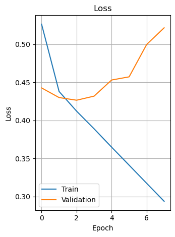

# 🍽️ 음식점 리뷰 감정분석 프로젝트

## 모델 개요
- 한국어 음식점 리뷰 데이터 약 360,000개를 바탕으로 감정 분류 모델 개발
- 감정 라벨: 0 = 부정, 1 = 중립, 2 = 긍정
- 사용 모델: LSTM, BERT (KcELECTRA)

## 모델 성능 비교

| 항목             | LSTM (Keras 기반)                                                               | BERT (KcELECTRA / HuggingFace)                                                   |
| -------------- | ----------------------------------------------------------------------------- | -------------------------------------------------------------------------------- |
| **전처리 방식**     | - 결측치 제거 (`dropna`) - 특수문자/숫자 제거 - Tokenizer로 시퀀스 변환 및 패딩 (`maxlen=80`) | - 결측치 및 중복 제거 - 레이블 균형화 - HuggingFace `AutoTokenizer` 사용 (`max_length=35`) |
| **데이터 균형화**    | 각 클래스당 20,871건으로 다운샘플링                                                        | 각 클래스당 20,852건으로 다운샘플링                                                           |
| **평균 정확도**     | **84.1%**                                                                     | **71.3%**                                                                        |
| **클래스별 F1 점수** | 부정: 0.56 중립: 0.28 긍정: 0.92                                              | 부정: 0.78 중립: 0.60 긍정: 0.73                                                 |
| **장점**         | - 학습/추론 속도 빠름 - 구조 간단                                                      | - 문맥 이해력 우수 - 전반적으로 균형 잡힌 예측 성능                                               |
| **단점**         | - 중립 감정 분류 성능 낮음 - 단어 단위 처리로 문맥 이해 부족                                      | - 학습 시간 길고 메모리/자원 소모 큼                                                           |

| 항목          | LSTM (불균형 데이터)      | BERT (균형 데이터, KcELECTRA) |
| ----------- | ------------------- | ------------------------ |
| 전체 정확도      | 높음 (84%)            | 낮음 (71%)                 |
| 중립/부정 인식    | 부정확함 (중립 f1 = 0.28) | 잘함 (중립 f1 = 0.60)        |
| 실제 감정 분석 성능 | 떨어짐 (긍정 편향)         | 더 현실적인 성능 (균형 잡힘)        |

📌 그래서 결론은?
정확도만 보면 LSTM이 더 좋아 보여도,
실제로는 BERT가 감정 분류를 더 정확하고 공정하게 함
(특히 중립/부정 감정 분류에서 확실한 우세)

## 분류 평가 지표
- ### 🔹 LSTM

- ### 🔹 BERT

## 📊 시각화 자료
- ### 🔹 LSTM 정확도/손실 그래프
 
- ### 🔹 BERT 정확도/손실 그래프
 
- ### 🔹 워드클라우드
- 부정단어  - 중립단어  - 긍정단어 
